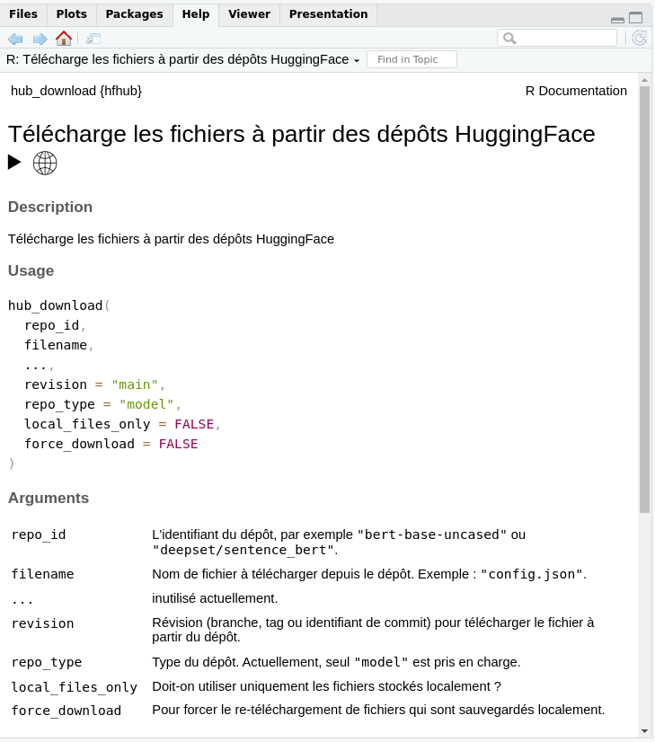

# hfhub.fr

<!-- badges: start -->

<!-- badges: end -->

Le paquet d'internationalisation de **{hfhub}** en français (fr)

## Installation

Vous pouvez installer la version de development de **{hfhub.fr}** depuis [GitHub](https://github.com/) via:

``` r
# install.packages("devtools")
devtools::install_github("eliocamp/rhelpi18n")
devtools::install_github("cregouby/hfhub.fr")
```

## Exemple

Voici comment utiliser {hfhub} avec l'aide en français :

``` r
# configure la session en langue française
Sys.setenv(LANGUAGE = "fr")

# charge la librairie hfhub en traduction française et {hfhub}
library(hfhub.fr)
library(hfhub)

# consulte l'aide normalement
?hub_download
```


